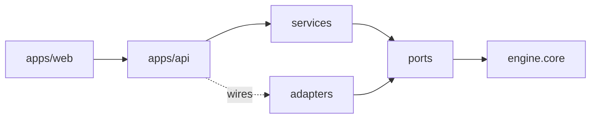
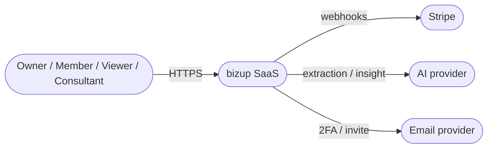
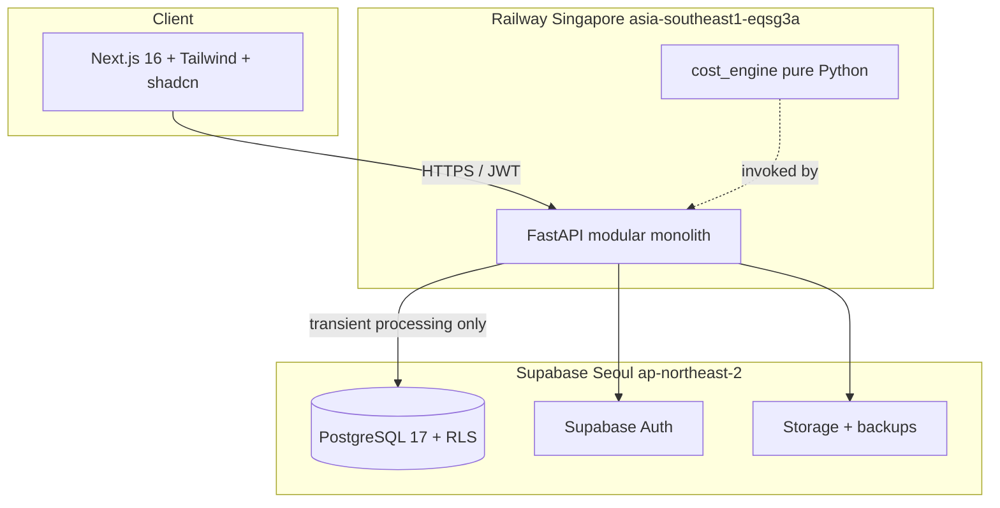
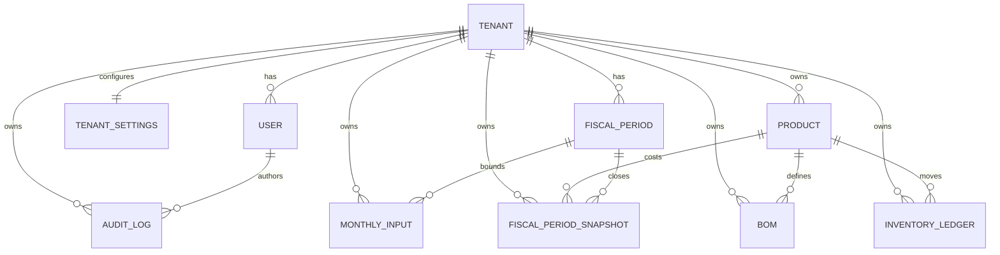
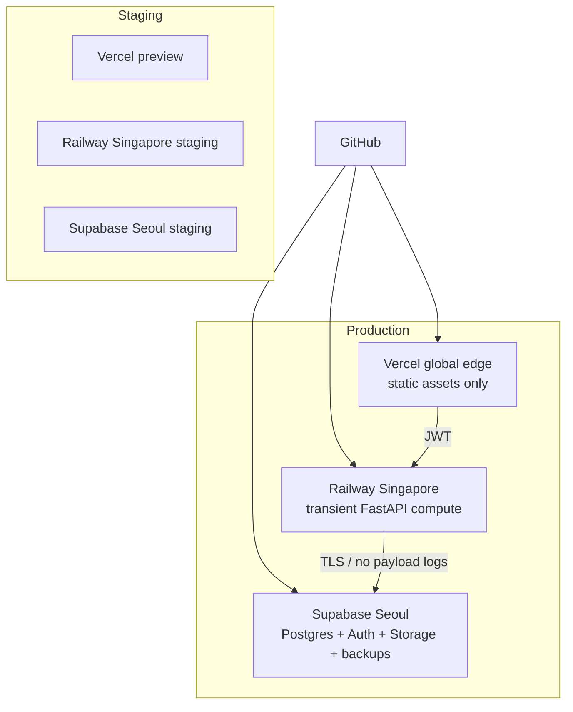

# Architecture Spine — bizup

## Design Paradigm

**Modular Monolith with Hexagonal Core.** The cost calculation engine and accounting axioms (PRD §3 A1–A11) form a **hexagonal core** — pure Python domain, ports for inbound/outbound, adapters at the boundary. The SaaS shell (auth, billing, multi-tenancy, reporting UI) is a **modular monolith** — one FastAPI deployable on Railway, module boundaries enforced by directory structure and import rules, no inter-module RPC. The frontend is a Next.js App Router monolith on Vercel.

Namespaces/directories map:

- `apps/web/` — Next.js frontend (modules by PRD M0–M12 feature folders)
- `apps/api/` — FastAPI backend (modules by PRD M0–M12 + `core/`)
- `packages/cost_engine/` — pure Python hexagonal core (no I/O, DB, clock, or randomness)
- `packages/cost_engine/ports/` — inbound use-cases and outbound repository/calculator contracts
- `packages/cost_engine/adapters/` — DB, REST, and CSV/Excel adapters

The hexagonal core is the system of record for arithmetic correctness. The modular monolith preserves the 1-operator constraint (G2: 새벽에 혼자 고칠 수 있는 시스템).

## Invariants & Rules

### AD-1 — Modular Monolith + Hexagonal Core paradigm

- **Binds:** all (cross-cutting)
- **Prevents:** builders coupling the engine to a DB driver or web framework and breaking deterministic 1원 regression
- **Rule:** `packages/cost_engine/` imports only stdlib plus approved math libraries; it never imports DB/web clients, environment access, clock, or randomness outside tests. SaaS modules invoke the engine through ports only.

### AD-2 — Append-only ledger

- **Binds:** §3 A8, §11 V2, §16 ERD, UJ-1 step 5, UJ-3 step 4
- **Prevents:** inventory/audit rows being silently mutated and destroying reconciliation or traceability
- **Rule:** `inventory_ledger` and `audit_logs` are INSERT-only. PostgreSQL `BEFORE UPDATE OR DELETE` row-level triggers raise `append-only violation`. Corrections use the AD-22 reversal sequence; originals are never changed.

### AD-3 — Multi-tenant isolation via Supabase RLS

- **Binds:** §13.2, UJ-1/UJ-3/UJ-4
- **Prevents:** tenant data leakage and privilege confusion
- **Rule:** every business table has `tenant_id UUID NOT NULL` and an RLS policy equivalent to `tenant_id = (auth.jwt() ->> 'tenant_id')::uuid`. The backend derives tenant identity from JWT, never from request data. Every `service_role` bypass writes a typed audit row before the privileged action.

### AD-4 — Calculation transaction atomicity

- **Binds:** M3, §6.1, §11 V1·V4·V7·V8, UJ-1 step 3–4
- **Prevents:** partial results persisting or being treated as authoritative
- **Rule:** AD-19's calculation entry point runs one `REPEATABLE READ` DB transaction. Verification runs inside it. Any violation rolls back the whole transaction. Only AD-20 `committed` results are authoritative or exposed through normal read ports.

### AD-5 — Cost-engine purity

- **Binds:** §13.2 순수 Python 원가엔진, §11 V8, §16 engine 산식
- **Prevents:** non-determinism breaking Excel ↔ Python 1원 regression
- **Rule:** engine functions are pure `f(inputs: dataclass) -> dataclass`. I/O, DB, clock, randomness, global state, snapshot writes, and logs remain outside the engine in services/adapters.

### AD-6 — Fiscal-period close lock

- **Binds:** §3 A1·A7, UJ-1 step 5
- **Prevents:** post-close mutations distorting inventory and P&L
- **Rule:** rows bounded by `fiscal_periods.status='closed'` reject business-data INSERTs except AD-22 reversal/correction events. Reopen requires an operator action, reason, and audit row and triggers AD-25 invalidation.

### AD-7 — AI non-authoritative

- **Binds:** §12, SM-3·SM-3a
- **Prevents:** AI output contaminating accounting calculations without human confirmation
- **Rule:** AI output is stored only as `input_drafts`. It reaches confirmed inputs exclusively through AD-17. AI commentary is labeled `ai_reference`; deterministic template analysis is labeled `auto_analysis`. Attempts by M10 to write confirmed-input tables are denied and counted; target is zero.

### AD-8 — Monetary types

- **Binds:** §9 common formats, §11 V1·V8, §3 A6
- **Prevents:** floating-point drift breaking 1원 reconciliation
- **Rule:** storage uses `BIGINT` for KRW integer units or `NUMERIC(18,2)` for USD. Python uses `decimal.Decimal`; `float` is forbidden on cost paths. UI formats KRW as integer and USD to two decimals.

### AD-9 — Seoul storage, Singapore compute

- **Binds:** §13.3, UJ-3·UJ-4, 1-operator managed-infrastructure constraint
- **Prevents:** an impossible Railway Seoul deployment and undeclared cross-border processing
- **Rule:** tenant data at rest, Auth, Storage, and backups live in Supabase `ap-northeast-2` (Seoul). FastAPI runs in Railway `asia-southeast1-eqsg3a` (Singapore) and may process tenant payloads only in memory; tenant payload logging, persistent disk writes, response caching, and backups on Railway are forbidden. Vercel may cache static assets globally but never tenant data. Cross-region DB replication is disabled. Before pilot launch, the operator must complete PIPA cross-border processing notice/consent and processor-contract review.

### AD-10 — Identity & roles

- **Binds:** §13.3, M12, UJ-4 step 6
- **Prevents:** privilege escalation and tenant-role confusion
- **Rule:** Supabase Auth uses email plus mandatory 2FA. Roles are `owner`, `member`, `viewer`, and consent-bound read-only `consultant_proxy`. JWT carries `tenant_id` and `role`; backend middleware enforces role per endpoint.

### AD-11 — Dependency direction

- **Binds:** AD-1, AD-5
- **Prevents:** cross-layer shortcuts defeating hexagonal isolation
- **Rule:** `ui → api → services → ports → engine`, while adapters implement ports. Engine-to-adapter/service/UI imports and direct adapter-to-engine imports are forbidden and checked in CI.



### AD-12 — Verification-first calculation flow

- **Binds:** AD-4, AD-19, AD-20, §11 V1·V4·V7·V8, M3
- **Prevents:** partial result exposure and orphaned calculation rows
- **Rule:** M3 runs: input validation → engine calculation → V1→V4→V7→V8 in order → `verified` → snapshot persistence → `committed`. A failed check aborts later checks and rolls back. Service-only tenants skip inapplicable V1/V4 but still run V7/V8. No failed or partial result is committed.

### AD-13 — Input-collection adapter

- **Binds:** UJ-1·UJ-2 step 1–2, E4, M2 acceptance
- **Prevents:** UI shapes leaking into engine input contracts
- **Rule:** `MonthInputAdapter` is the only caller of engine input ports. It normalizes the six streams across daily/monthly modes, applies FTE conversion and conditional machine-time exposure, and produces `MonthlyInput`. UI calls the adapter, never the engine.

### AD-14 — Web-verified stack pin

- **Binds:** all modules
- **Prevents:** build drift to non-existent regions or unverified dependency versions
- **Rule:** the Stack table is the 2026-07-24 cold-start pin. Lockfiles must resolve these versions exactly; changes require CI and V8 regression. Banned infrastructure: Celery, Kafka, Redis as a persistent queue, and unmanaged components that violate the 1-operator constraint.

### AD-15 — Cross-language conventions

- **Binds:** AD-8, AD-9, AD-24, all modules
- **Prevents:** naming, time, identifier, error, and money drift
- **Rule:** DB/Python use `snake_case`; Next.js routes use `kebab-case`; React/TS types use `PascalCase`. Store ISO-8601 UTC `TIMESTAMPTZ`, display KST. Period keys follow AD-24. IDs are UUID v7; `tenant_id` is ULID. Errors are `{code, message_ko, details, trace_id}`. Logs are structlog JSON with `trace_id`. Money follows AD-8.

### AD-16 — Fiscal snapshot contract

- **Binds:** M3 writer, M5 reporting, M11 close, AD-4, AD-20
- **Prevents:** JSON-blob, per-period, and per-segment snapshot implementations becoming mutually unreadable
- **Rule:** `fiscal_period_snapshots` is uniquely keyed by `(tenant_id, period_key, segment_id, engine_type)` and stores normalized `material_cost`, `labor_cost`, `overhead_cost`, `manufacturing_cost`, `inventory_adjustment`, `state`, and deterministic `result_hash`. Opaque result JSON is forbidden. M3 is the only writer; M5 and M11 are read-only consumers.

### AD-17 — AI draft promotion port

- **Binds:** M0/M10 drafts, M2 confirmed input, M3 engine gate, AD-7
- **Prevents:** multiple confirmation APIs producing incompatible `MonthlyInput` shapes or deleting the audit source
- **Rule:** only M2 may call `InputPromoter.promote(tenant_id, period_key, draft_ids) -> MonthlyInput`. The DB adapter implements it and is idempotent on `(tenant_id, period_key, source_draft_id)`. Promotion retains the draft with `state='promoted'`, records actor plus draft hash in `audit_logs`, and writes the canonical confirmed-input shape. M10 never writes confirmed inputs.

### AD-18 — Single product identity across costing methods

- **Binds:** M1 catalog, M3 traditional cost, M4 ledger, M5 reports, M9 ABC
- **Prevents:** `item_id`, `product_id`, and `cost_object_id` splitting one economic product
- **Rule:** `PRODUCT(product_id)` is the sole product/cost-object identity. `product_role` is `trad_only | abc_only | both`; traditional and ABC attributes extend the same entity. Engine results, inventory ledger, and reports join only on `product_id`. M9 may not mint a parallel cost-object identifier.

### AD-19 — One calculation entry point and owner

- **Binds:** M3, M9, M11, AD-4, AD-12
- **Prevents:** separate traditional/ABC buttons or endpoints running out of order and closing unreconciled results
- **Rule:** `POST /api/v1/calc` owned by M3 is the only public calculation endpoint and the UI shows one calculation action per period. M3 dispatches traditional and/or M9 ABC ports by tenant kind inside one AD-4 transaction. Service-only tenants use the same endpoint with only the applicable ABC path. M9 exposes no separate public calculation endpoint.

### AD-20 — Calculation result state machine

- **Binds:** M3 results, M5 visibility, M11 close/reversal, AD-4, AD-16
- **Prevents:** modules assigning incompatible meanings to draft, verified, locked, and reversed results
- **Rule:** state transitions are `draft → verified → committed → reversed`; `verification_status` is `pending | passed | failed`. `draft` and `verified` are transaction-internal. Only `committed` rows feed M5 or authoritative APIs. `reversed` is represented by an append-only AD-22 event and never by mutating the committed row. Failed rows roll back; attempts are captured in audit telemetry outside the result table.

### AD-21 — Single CCR definition

- **Binds:** M1 account tags, M3 allocation, M9 TDABC
- **Prevents:** M3 and M9 calculating different capacity-cost rates
- **Rule:** `CCR = department_indirect_cost / practical_capacity_hours`, where `department_indirect_cost` is the pre-allocation department total after direct labor and direct material are excluded by M1 account tags. M9 owns `CCRPort.compute(tenant_id, period_key, department_id) -> Decimal`; M3 consumes the result and never recomputes it.

### AD-22 — Reversal construction and ownership

- **Binds:** AD-2, AD-6, M4 inventory, M11 close correction
- **Prevents:** update-in-place, sign conventions, and duplicate reversals diverging across modules
- **Rule:** a correction inserts (1) one sign-negating reversal row with `reverses_event_id` and `reversal_of_period_key`, then (2) an optional corrected business row sharing `correction_group_id`. The original never changes. `(tenant_id, reverses_event_id)` is unique. M4 calls `request_reversal(event_id, reason)`; only M11 authorizes and writes the sequence.

### AD-23 — One tenant settings aggregate

- **Binds:** M0 onboarding, M1 baseline, M9 ABC, M10 AI defaults, AD-3
- **Prevents:** modules creating independently migrated settings tables and update paths
- **Rule:** exactly one `tenant_settings` row per tenant contains `settings_version` plus schema-validated JSONB namespaces `onboarding`, `baseline`, `abc`, and `ai`. Each module writes only its namespace through a version-checked settings service. Parallel settings tables are forbidden.

### AD-24 — Typed period-key namespaces

- **Binds:** M3 fiscal calculation, M5 YTD, M8 budget, M11 close
- **Prevents:** virtual budget periods entering fiscal YTD or close queries
- **Rule:** real fiscal keys are `YYYY-MM`; virtual budget keys are `YYYY-MM#B<n>`. M8 alone mints virtual keys. M5 YTD defaults to fiscal keys; budget-vs-actual explicitly joins virtual and fiscal rows by `YYYY-MM` prefix. M11 may close only fiscal keys.

### AD-25 — AI insight cache invalidation

- **Binds:** M10 insight cache, M3 commit, AD-22 reversal, M11 reopen
- **Prevents:** AI insights surviving changes to the authoritative closed-period result
- **Rule:** M10 cache key is `(tenant_id, period_key, calculation_result_hash)`. A new AD-4 commit, an AD-22 reversal insert, or an M11 reopen emits one DB notification; the M10 adapter consumes it and invalidates matching entries. Application polling and input-write-only invalidation are forbidden.

## Consistency Conventions

| Concern | Convention |
| --- | --- |
| Naming | snake_case DB/Python; kebab-case routes; PascalCase React/TS (AD-15) |
| Identity | ULID tenant; UUID v7 business IDs; one `product_id` (AD-15·AD-18) |
| Dates and periods | ISO-8601 UTC; KST display; typed period keys (AD-15·AD-24) |
| Mutation and state | append-only corrections; calculation state machine (AD-2·AD-20·AD-22) |
| Auth and config | Supabase Auth/RLS; one versioned settings aggregate (AD-3·AD-10·AD-23) |

## Stack

| Name | Cold-start pin |
| --- | --- |
| Node.js | 24.18.0 LTS |
| Next.js | 16.2.11 (App Router) |
| React | 19.2.8 |
| TypeScript | 7.0.2 |
| Tailwind CSS | 4.3.3 |
| shadcn CLI | 4.14.1; generated components are code-owned |
| TanStack React Table | 8.21.3 |
| next-intl | 4.13.4 |
| Recharts | 3.10.0 |
| Python | 3.12.x runtime |
| FastAPI | 0.139.2 |
| Pydantic | 2.13.4 |
| SQLAlchemy | 2.0.51 async |
| Alembic | 1.18.5 |
| pytest | 9.1.1 |
| PostgreSQL | 17 on Supabase |
| Supabase | `ap-northeast-2` Seoul |
| Stripe API | `2026-06-24.dahlia` |
| Vercel | managed frontend; no tenant-data edge cache |
| Railway | `asia-southeast1-eqsg3a` Singapore |
| Anthropic Claude API | PRD-selected model family; exact model snapshot belongs to M10 config |
| structlog | 26.1.0 |
| uv | 0.11.32 |
| OpenTelemetry API | 1.44.0, traces only in MVP |

CI owns lockfiles and runs V8 before dependency changes. Version evidence was checked on 2026-07-24 against npm/PyPI registries and official provider documentation.

## Structural Seed

### Source tree

```text
bizup/
  apps/
    web/                         # Next.js 16 App Router
      app/[locale]/(dashboard)/
        m0-onboarding/ ... m12-account/
      components/
      lib/
    api/                         # FastAPI modular monolith
      modules/
        m0_onboarding/
        m1_baseline/
        m2_input/                # MonthInputAdapter + InputPromoter
        m3_calculate/            # sole /api/v1/calc orchestrator
        m4_inventory/
        m5_reports/
        m6_verification/
        m7_simulation/
        m8_budget/
        m9_abc/                  # internal engine port; no public calc API
        m10_ai/
        m11_close/
        m12_account/
      core/
  packages/
    cost_engine/
      core/
      ports/
      adapters/db/
      adapters/rest/
      adapters/csv_excel/
      tests/regression_v8/
  supabase/
    migrations/
    policies/
  pyproject.toml
  package.json
```

### System context



### Container view



### Core ERD



### Deployment and environments



Operational envelope: Vercel auto-scales static/frontend delivery. Railway starts at one FastAPI worker and may scale horizontally. No tenant payload is persisted outside Supabase Seoul. Supabase supplies daily backups. Connection pooling is revisited when concurrent tenants exceed 20.

## Capability → Architecture Map

| Capability / Area | Lives in | Governed by |
| --- | --- | --- |
| M0 Onboarding/settings/AI extraction | `m0_onboarding`, DB draft adapter | AD-3, AD-7, AD-23 |
| M1 Baseline/products/BOM/accounts | `m1_baseline`, engine BOM validation | AD-6, AD-18, AD-23 |
| M2 Six-stream input and confirmation | `m2_input`, adapters | AD-13, AD-17 |
| M3 Calculation and verification | `m3_calculate`, engine core | AD-4, AD-12, AD-16, AD-19, AD-20 |
| M4 Inventory ledger | `m4_inventory`, DB ledger adapter | AD-2, AD-6, AD-18, AD-22 |
| M5 Reports/PDF/A4 | `m5_reports` | AD-8, AD-16, AD-18, AD-20, AD-24 |
| M6 Verification V1–V8 | `m6_verification`, regression fixtures | AD-4, AD-5, AD-12 |
| M7 Simulation CVP/BEP | `m7_simulation`, pure engine functions | AD-5 |
| M8 Budget | `m8_budget` | AD-24, Deferred budget items |
| M9 ABC/TDABC/CCR | `m9_abc`, internal engine ports | AD-18, AD-19, AD-21 |
| M10 AI extraction/insight/estimation | `m10_ai`, draft/cache adapters | AD-7, AD-17, AD-25 |
| M11 Close/snapshot/reversal | `m11_close` | AD-6, AD-16, AD-20, AD-22, AD-25 |
| M12 Account/2FA/backup/proxy | `m12_account` | AD-3, AD-10 |

## Deferred and Open Questions

- **PIPA cross-border processing review — before pilot launch:** confirm notice/consent, processor agreement, retention, and incident-response duties for transient Railway Singapore processing while data is stored in Seoul.
- **Adversary Medium findings (AD-26 candidates):** split `source` from `is_estimated`; define one department entity; type `service_role` bypass audit; decide whether a separate non-authoritative preview port exists; persist daily-input granularity; fix verifier-row skip/order details beyond AD-12. Resolve before Implementation Readiness.
- **Adversary Low findings:** onboarding gate, report template cache key, one AI extraction port, and budget scenario ownership. Resolve with the owning Epic before its first Story.
- **A×B×C×D budgeting engine (2차):** formula retained, UI placeholder only.
- **Multiple budget scenarios (2차):** M8 enforces one scenario in MVP.
- **Mixed classic/TDABC override (2차):** schema extension only, no MVP UI.
- **Manufacturing ABC parallel view (3차).**
- **Additional locales (2차):** infrastructure exists; ko-KR content only in MVP.
- **Multi-agent cost-analysis committee (3차).**
- **Quantified SLO/RPO/RTO:** set from first pilot measurements.
- **OpenTelemetry backend:** traces instrumented; exporter selected before production observability setup.
- **Connection pool:** introduce after 20 concurrent tenants.
- **Stripe tiered pricing:** one tier in MVP until PRD OQ-2 closes.
- **Native mobile app:** responsive web only.

## Operational Envelope Notes

The 1-operator constraint drives managed services and rules out self-managed queues. Tenant data is stored only in Seoul, while compute occurs transiently in Singapore under AD-9. The pure engine and typed cross-module contracts make V8 regression possible without the full stack. Quantitative SLOs remain deferred until pilot evidence exists.

## Verification Sources

- Railway regions: https://docs.railway.com/reference/deployment-regions
- Supabase regions: https://supabase.com/docs/guides/platform/regions
- Node.js release lines: https://nodejs.org/en/about/previous-releases
- Stripe API versioning: https://docs.stripe.com/api/versioning
- Package versions: npm and PyPI registries queried on 2026-07-24
